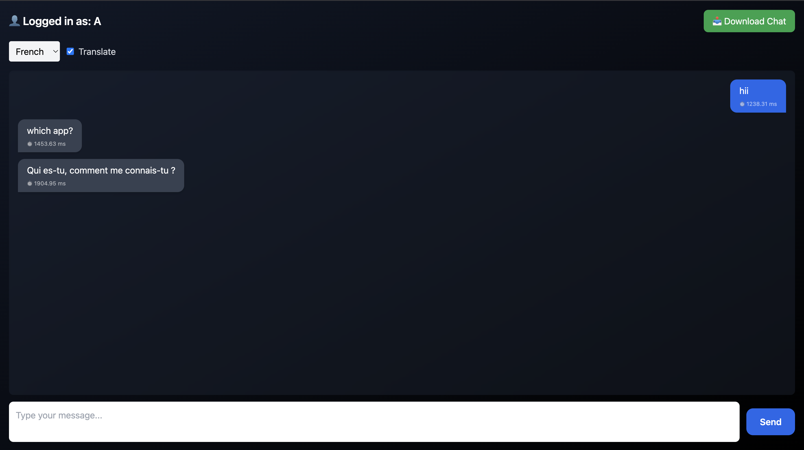
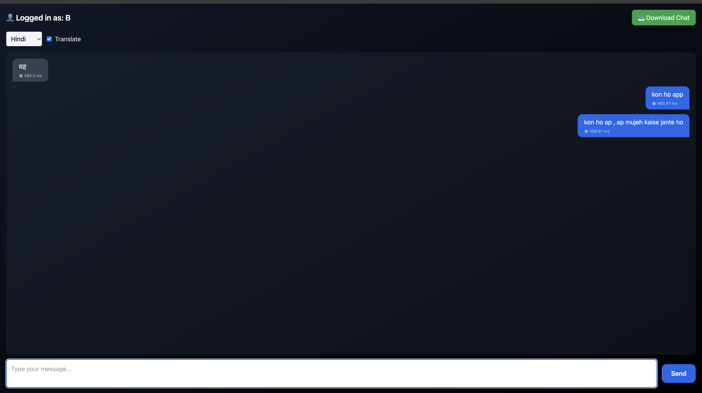
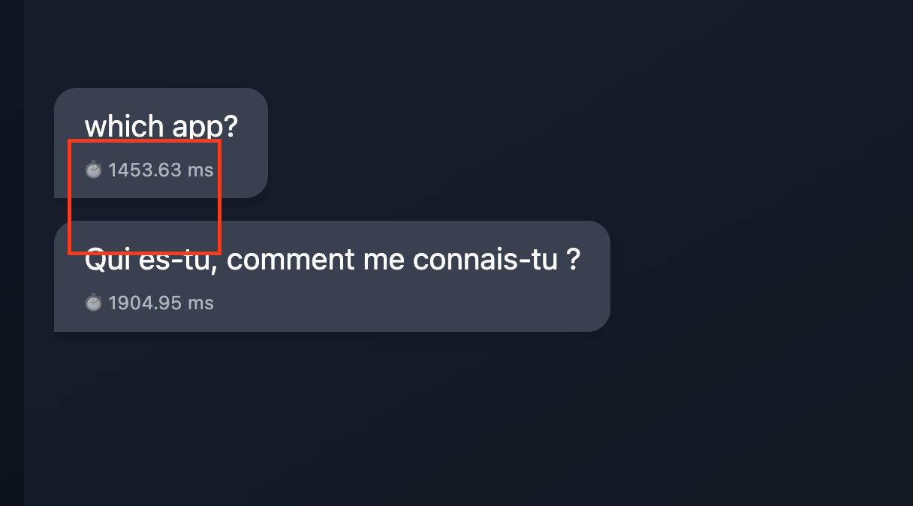
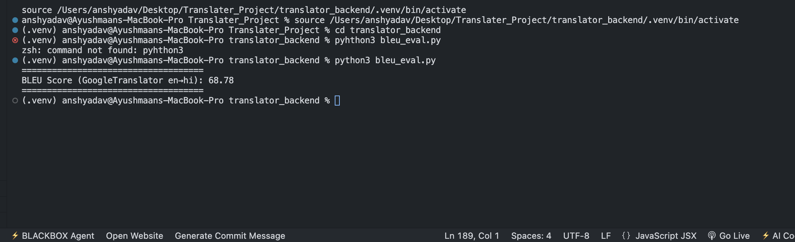

# 📌 **Realtime Multilingual Chat**
**By: Ayushmaan Singh Yadav**

A real-time multilingual chat system supporting auto-translation, per-user language preference, latency measurement, BLEU evaluation, and chat download feature.  
The system is built using **FastAPI**, **WebSockets**, **React**, **TailwindCSS**, **Framer Motion**, and **Deep-Translator (Google Translation API wrapper)**.

---

# 🚀 **Project Highlights**
- ⚡ **Real-time chat** using WebSockets (FastAPI backend)
- 🌐 **Live translation** (GoogleTranslator)
- 👤 **Per-user language preference**
- 🧠 **Auto-detect + manual language selection**
- ⏱ **Latency measurement per message (ms)**
- 📊 **BLEU evaluation (GoogleTranslator BLEU = 68.78)**
- 🌑 **Dark/Light theme support**
- 📥 **Download full chat as an image (html2canvas)**
- 🌀 **Smooth UI animations (Framer Motion)**
- 🔄 **Stable WebSocket reconnection**
- 🧪 **Baseline model comparison (Helsinki-NLP MarianMT)**

---

# 📂 **Project Structure**
```
Realtime-Multilingual-Chat/
│── translator_backend/
│   ├── main.py
│   ├── bleu_eval.py
│   ├── evaluate_models.py
│   ├── requirements.txt
│   └── .env (optional)
│
│── translator_ui/
│   ├── src/components/
│   │   ├── ChatBox.jsx
│   │   └── Sidebar.jsx
│   ├── public/
│   └── package.json
│
└── README.md
```

---

# 🛠 **Tech Stack**
### **Backend**
- FastAPI  
- WebSockets  
- Deep-Translator  
- GoogleTranslator  
- SacreBLEU  
- Transformers  
- MarianMT  
- Python 3.10  

### **Frontend**
- React.js  
- TailwindCSS  
- Framer Motion  
- html2canvas  
- WebSockets  

---

# 📸 **Screenshots**
(Add your screenshots here manually)








---

# ⚙️ **Setup Instructions**

## 1️⃣ Backend Setup (FastAPI)

### **Step 1: Create Virtual Environment**
```bash
python3 -m venv .venv
source .venv/bin/activate   # macOS/Linux
.venv\Scripts\activate      # Windows
```

### **Step 2: Install Dependencies**
```bash
pip install -r requirements.txt
```

### **requirements.txt**
```
fastapi
uvicorn[standard]
deep-translator
transformers
torch
sacrebleu
langdetect
python-multipart
python-dotenv
```

### **Step 3: Run Backend**
```bash
uvicorn main:app --reload
```

Backend runs at:  
📍 **http://127.0.0.1:8000**

---

# 2️⃣ **Frontend Setup (React)**

```bash
cd translator_ui
npm install
npm start
```

Runs at  
📍 **http://localhost:3000**

---

# 🧠 **Model Evaluation**

### ✔ **BLEU Evaluation**
Run:
```bash
python bleu_eval.py
```
Output:
```
BLEU Score (GoogleTranslator en→hi): 68.78
```

---

### ✔ **Model Comparison (HF MarianMT vs Google)**
Run:
```bash
python evaluate_models.py
```

Shows:
- Model translation outputs  
- Inference time  
- BLEU scores  

---

# ⏱ **Latency Measurement**
Each message payload includes latency:

```json
{
  "sender": "A",
  "original": "Hello!",
  "translated": "नमस्ते!",
  "latency": 142.33,
  "timestamp": 1732855511.27
}
```

Displayed in the UI per message.

---

# 🌐 **WebSocket API**

### **URL**
```
ws://127.0.0.1:8000/ws/{user}
```

### **Set Preferred Language**
```json
{ "type": "set_lang", "lang": "hi" }
```

### **Send Chat Message**
```json
{
  "type": "message",
  "text": "Hello",
  "translate": true
}
```

---

# 🚀 **Deployment Guide**

### **Option 1: Render / Railway**
- Deploy FastAPI backend  
- Deploy React frontend

### **Option 2: Docker**
Dockerfile + docker-compose can be added (ask me).

### **Option 3: Nginx Reverse Proxy**
For production WebSocket stability.

---

# 🎥 **Optional Demo Video**
3–5 minutes video covering:
- Architecture  
- Real-time translation  
- BLEU score  
- Latency  
- Full UI demo  

---

# 📝 **Author**
**Ayushmaan Singh Yadav**  
Realtime Multilingual Chat — 2025

---

